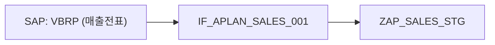

# APlan Integration Impact Map – MRD (for Cursor AI)

## 1. 문서 목적

이 문서는 Cursor AI를 활용해 개발할 **APlan Integration Impact Map** 웹툴의 요구사항을 정의한다.  
Cursor는 이 문서를 기반으로 **FastAPI + SQLModel + SQLite + Jinja + Mermaid.js**를 사용하는 프로젝트 스캐폴딩과 주요 코드를 생성해야 한다.

---

## 2. 프로젝트 개요

### 2.1 한 줄 정의

> **이 프로젝트는 APlan과 연계된 Legacy 시스템(SAP, BW, IAM, NPD, CDP)과 연계 툴(EAI)의 인터페이스·테이블·리포트 메타데이터를 DB에 저장하고, 특정 오브젝트를 선택했을 때 Up/Downstream 영향도와 Mermaid 다이어그램을 시각화해 주는 내부용 웹툴이다.**

### 2.2 특징

- 실제 업무 데이터(전표, 금액, 고객, 개인정보 등)는 **취급하지 않는다**.
- APlan, SAP, BW 등에 **직접 연결(조회/갱신)**하지 않고,
  - 운영/PM이 관리하는 **엑셀 파일(`mapping.xlsx`)의 메타데이터**만 사용한다.
- 사용 목적
  - 인터페이스 영향도 분석
  - CR/릴리즈 시 영향 범위 설명
  - 운영/인수인계 시 **APlan–SAP–BW 연계 구조 가시화**

---

## 3. 개발 범위 (MVP, 1개월 스코프)

### 3.1 포함 범위

1. **메타데이터 DB 설계 및 구현**
   - `IntegrationObject` (오브젝트 노드)
   - `IntegrationRelation` (오브젝트 간 관계 엣지)

2. **엑셀 기반 메타데이터 로딩 스크립트**
   - `mapping.xlsx`의
     - `objects` 시트 → `IntegrationObject` 테이블
     - `relations` 시트 → `IntegrationRelation` 테이블
   - UPSERT 방식으로 반영 (기존 key는 update, 신규는 insert)

3. **검색 화면 (`/`)**
   - 키워드 및 필터(system_type, object_type) 기반 검색
   - 결과 리스트 클릭 → 상세 화면 이동

4. **상세 + 영향도 화면 (`/objects/{id}`)**
   - 선택 오브젝트의 기본 정보 표시
   - Upstream / Downstream 오브젝트 리스트
   - Mermaid 다이어그램 텍스트 + 실제 다이어그램 렌더링

5. **Mermaid 다이어그램 생성 로직**
   - 주어진 오브젝트 기준 **depth 1~2**까지 그래프 탐색
   - Mermaid `flowchart LR` 형식의 텍스트 생성
   - 템플릿에서 `<div class="mermaid">`로 렌더링

### 3.2 제외 범위 (후속 Phase)

- 전체 시스템 오버뷰(Overview) 화면 (모든 인터페이스를 한눈에 보는 대시보드)
- Admin UI (웹에서 Object/Relation CRUD)
- 웹 기반 CSV/엑셀 업로드 UI
- 다수 오브젝트 선택 후 “릴리즈 Impact 리포트” 생성 기능
- 인증/SSO, 권한 관리

---

## 4. 기술 스택 및 구조

### 4.1 기술 스택

- 언어: **Python 3.11**
- 웹 프레임워크: **FastAPI**
- DB:
  - MVP: **SQLite** (예: `sqlite:///./impact_map.db`)
  - 추후 PostgreSQL 확장 가능
- ORM: **SQLModel**
- 템플릿 엔진: **Jinja2**
- 프론트 스타일: 기본 HTML + 간단 CSS (Bootstrap CDN 사용 가능)
- 다이어그램: **Mermaid.js** (CDN 사용, 클라이언트 렌더링)
- 실행: `uvicorn app.main:app --reload`

### 4.2 디렉토리 구조(요청)

```text
app/
  __init__.py
  main.py
  models.py
  database.py
  routers/
    __init__.py
    objects.py
  services/
    __init__.py
    impact_service.py   # 그래프 탐색 및 mermaid 생성 로직
  templates/
    base.html
    index.html          # 검색 화면
    object_detail.html  # 상세/영향도 화면
static/
  css/...
mapping.xlsx            # 메타데이터 엑셀 (수동 관리)
load_mapping.py         # 엑셀→DB 로딩 스크립트
```

---

## 5. 데이터 모델 요구사항

### 5.1 IntegrationObject 테이블

APlan과 연계된 **인터페이스/테이블/리포트/Job 등 모든 오브젝트**를 표현한다.

**필드 정의 (SQLModel 기준)**

- `id: int`  
  - PK, Auto Increment
- `object_key: str`  
  - 업무상 유일키  
  - 예: `IF_APLAN_SALES_001`, `ZAP_SALES_STG`, `BW_SOP_CUBE`
  - Unique + Index
- `name: str`  
  - 표시 이름 (한글/영문 모두 가능)
- `system_type: str`  
  - 예: `SAP`, `APLAN`, `BW`, `BI`, `EAI`, `IAM`, `NPD`, `CDP`, `LEGACY`
- `object_type: str`  
  - 예: `IF`, `TABLE`, `VIEW`, `JOB`, `REPORT`, `UI`
- `layer: str`  
  - 예: `Legacy`, `API`, `Cust`, `In`, `Staging`, `Out`, `UI`
- `description: Optional[str]`
- `owner_team: Optional[str]`  
  - 담당 조직/팀 (예: `ERP 플랫폼서비스팀`, `SCI 실`)
- `module: Optional[str]`  
  - 업무 도메인 (예: `S&OP`, `재고`, `판매`, `생산`, `구매`)
- `status: str`  
  - 기본값 `"ACTIVE"`  
  - 값: `"ACTIVE"`, `"DRAFT"`, `"DEPRECATED"`
- `tags: Optional[str]`  
  - `"콤마,구분,키워드"` 형태 (예: `"수요계획,판매,SD"`)
- `environment: str`  
  - 기본값 `"PRD"`  
  - 예: `"PRD"`, `"QAS"`, `"DEV"`

**소스/거버넌스 필드**

- `source_doc: Optional[str]`  
  - 엑셀 파일명 (예: `APlan_IF_Mapping_2025Q1.xlsx`)
- `source_sheet: Optional[str]`  
  - 엑셀 시트명 (`objects`)
- `source_row: Optional[int]`  
  - 엑셀 행 번호
- `created_at: datetime` (default: `datetime.utcnow`)
- `updated_at: datetime` (default: `datetime.utcnow`, 저장 시 업데이트)

**관계**

- `outgoing_relations: list[IntegrationRelation]`  
  - from_object 기준 Relation 리스트
- `incoming_relations: list[IntegrationRelation]`  
  - to_object 기준 Relation 리스트

---

### 5.2 IntegrationRelation 테이블

오브젝트 간 **데이터 흐름/참조 관계(그래프 엣지)**를 표현한다.

**필드 정의**

- `id: int`  
  - PK
- `from_object_id: int`  
  - FK → `IntegrationObject.id`
- `to_object_id: int`  
  - FK → `IntegrationObject.id`
- `relation_type: str`  
  - 기본값 `"FLOWS_TO"`  
  - MVP에서는 `"FLOWS_TO"`만 사용
- `description: Optional[str]`  
  - 예: `"SAP SD 매출실적 → APlan 수요계획 Staging 적재"`
- `status: str`  
  - 기본값 `"ACTIVE"`  
  - 값: `"ACTIVE"`, `"DRAFT"`, `"DEPRECATED"`

**소스/거버넌스 필드**

- `source_doc: Optional[str]`
- `source_sheet: Optional[str]`
- `source_row: Optional[int]`
- `created_at: datetime`
- `updated_at: datetime`

**관계**

- `from_object: IntegrationObject`  
  - back_populates: `outgoing_relations`
- `to_object: IntegrationObject`  
  - back_populates: `incoming_relations`

---

## 6. 메타데이터 엑셀 구조 요구사항

운영/PM이 관리하는 `mapping.xlsx` 파일을 기준으로 메타데이터를 관리한다.

### 6.1 파일 및 시트

- 파일명: `mapping.xlsx`
- 시트:
  - `objects` 시트 → IntegrationObject
  - `relations` 시트 → IntegrationRelation

### 6.2 `objects` 시트 컬럼

**헤더 예시 (왼쪽부터 순서 고정)**

1. `object_key` (필수)
2. `name` (필수)
3. `system_type` (필수)
4. `object_type` (필수)
5. `layer` (필수)
6. `description`
7. `owner_team`
8. `module`
9. `status` (기본값: `ACTIVE`)
10. `tags`
11. `environment` (기본값: `PRD`)
12. `source_doc`   (없으면 코드에서 파일명 사용)
13. `source_sheet` (없으면 `"objects"`)
14. `source_row`   (없으면 코드에서 엑셀 행 번호 기준 자동 세팅)

### 6.3 `relations` 시트 컬럼

1. `from_key` (필수, IntegrationObject.object_key 참조)
2. `to_key`   (필수)
3. `relation_type` (없으면 기본 `"FLOWS_TO"`)
4. `description`
5. `status` (기본값: `ACTIVE`)
6. `source_doc`
7. `source_sheet`
8. `source_row`

### 6.4 로딩 스크립트 요구사항

- 파일: `load_mapping.py`
- 역할:
  - `mapping.xlsx`의 두 시트를 `pandas.read_excel`로 읽어서 DB에 UPSERT
- 동작 상세:
  - `objects`:
    - `object_key` 기준으로 `IntegrationObject` 조회
      - 존재하면 UPDATE
      - 없으면 INSERT
    - `source_doc`/`source_sheet`/`source_row`는 값 없는 경우 기본값으로 세팅
  - `relations`:
    - `from_key`/`to_key`로 `IntegrationObject.object_key` 조회
    - 매칭 실패 시 WARNING 로그 출력 후 스킵
    - `(from_object_id, to_object_id, relation_type)` 조합 기준으로 UPSERT

---

## 7. API 요구사항

### 7.1 `GET /objects`

**설명**

- 검색/리스트 조회용 API.  
- 검색 화면에서 사용.

**쿼리 파라미터**

- `q: str | None`  
  - object_key, name, description LIKE 검색
- `system_type: str | None`
- `object_type: str | None`
- `limit: int = 50`

**응답**

- JSON 배열 형태:
  - `id`, `object_key`, `name`, `system_type`, `object_type`, `layer`, `description`, `status`, `module` 정도의 핵심 필드 포함

---

### 7.2 `GET /objects/{object_id}`

**설명**

- 단일 오브젝트 상세 조회
- 상세 화면 기본 정보 표시용

**응답**

- `IntegrationObject` 전체 필드 또는 화면에 필요한 필드 전부

---

### 7.3 `GET /objects/{object_id}/impact`

**설명**

- 특정 오브젝트 기준 Upstream/Downstream 영향도 정보 조회
- depth 1~2까지 지원

**쿼리 파라미터**

- `depth: int = 1` (허용값: 1 또는 2)

**응답 예시**

```json
{
  "object": { "id": 10, "object_key": "IF_APLAN_SALES_001", "name": "..." },
  "upstream": [
    { "id": 3, "object_key": "SAP_VBRP", "name": "SAP 매출전표", "system_type": "SAP", "...": "..." }
  ],
  "downstream": [
    { "id": 11, "object_key": "ZAP_SALES_STG", "name": "수요계획 Staging", "system_type": "APLAN", "...": "..." }
  ]
}
```

---

### 7.4 `GET /objects/{object_id}/mermaid`

**설명**

- 특정 오브젝트를 중심으로 한 영향도 다이어그램의 **Mermaid 텍스트** 생성

**쿼리 파라미터**

- `depth: int = 2`

**응답 예시**

```json
{
  "mermaid_code": "flowchart LR\n  SAP_VBRP[\"SAP: VBRP\"] --> IF_APLAN_SALES[\"IF_APLAN_SALES_001\"] --> ZAP_SALES_STG[\"ZAP_SALES_STG\"]\n"
}
```

- 실제 화면에서는 이 값을 `<div class="mermaid">`에 넣어서 렌더링한다.

---

## 8. 화면(템플릿) 요구사항

### 8.1 공통 레이아웃 (`base.html`)

- 상단에 심플한 헤더: “APlan Integration Impact Map”
- 컨텐츠 영역을 블록으로 만들어 `index.html`, `object_detail.html`에서 확장

---

### 8.2 검색 화면 (`index.html` → `/`)

**구성**

- 상단 검색 폼:
  - 입력: 키워드(`q`)
  - 드롭다운: `system_type` (All / SAP / APLAN / BW / BI / EAI / …)
  - 드롭다운: `object_type` (All / IF / TABLE / REPORT / JOB / …)
  - 검색 버튼
- 하단 결과 테이블:
  - 컬럼:
    - `object_key`
    - `name`
    - `system_type`
    - `object_type`
    - `layer`
    - `module`
    - `status`
  - 각 행 클릭 시 `/objects/{id}`로 이동 (a 태그 링크)

---

### 8.3 상세/영향도 화면 (`object_detail.html` → `/objects/{id}`)

**레이아웃 (2컬럼)**

1. **좌측 패널 – 기본 정보**
   - 이름, object_key
   - system_type, object_type, layer
   - module, owner_team
   - status, environment
   - tags
   - description

2. **우측 상단 – 영향도 리스트**
   - Upstream 리스트 (테이블 형태)
   - Downstream 리스트 (테이블 형태)
   - 각 항목 클릭 시 해당 오브젝트 상세로 이동하도록 링크 처리

3. **우측 하단 – Mermaid 다이어그램 영역**
   - Mermaid 텍스트 (복사용 textarea, `readonly`)
   - “Copy Mermaid Code” 버튼
   - 실제 다이어그램:
     ```html
     <div class="mermaid">
       {{ mermaid_code }}
     </div>
     ```
   - `<head>` 또는 템플릿 상단에 mermaid.js CDN 및 초기화 코드:
     ```html
     <script src="https://unpkg.com/mermaid@11/dist/mermaid.min.js"></script>
     <script>
       mermaid.initialize({ startOnLoad: true });
     </script>
     ```

---

## 9. 그래프 탐색 & Mermaid 생성 요구사항

### 9.1 그래프 탐색 (impact_service.py)

- 입력:
  - `object_id: int`
  - `depth: int` (1 또는 2)
- 동작:
  - `depth=1`: 직접 연결된 상하위만 탐색  
    - outgoing_relations → downstream  
    - incoming_relations → upstream
  - `depth=2`: upstream/downstream의 한 단계 이웃까지 확장
- 출력:
  - 중심 오브젝트
  - upstream/downstream 리스트
  - Mermaid 노드/엣지 생성을 위한 구조

### 9.2 Mermaid 텍스트 생성

- 포맷: `flowchart LR`
- 노드:
  - 라벨 예: `"SAP\nVBRP"` 또는 `"IF\nIF_APLAN_SALES_001"`
- 기본 구조 예:



- 중심 오브젝트는 별도 스타일(class) 적용 가능 (선택 사항):
  - 예: `class center fill=#ffeb3b,stroke=#f57f17,stroke-width=3px;`

---

## 10. 비기능 요구사항

- **보안**
  - 외부 시스템(LLM, 외부 API) 호출 **금지**
  - 이 애플리케이션은 **엑셀 메타데이터만 사용**하며, 실제 업무 데이터는 취급하지 않는다.
- **네트워크**
  - 내부망에서 사용하는 전제 (인터넷 없이도 동작 가능해야 함 – mermaid.js CDN은 추후 로컬 호스팅으로 전환 용이하게 구성)
- **성능**
  - 초기에는 오브젝트 수 100~200개, Relation 200~500개 수준을 가정
  - 이 규모에서 `/objects`, `/objects/{id}` 요청은 체감 상 즉시 응답
- **운영**
  - `load_mapping.py` 실행만으로 메타데이터 최신화 가능해야 함
  - 오류/매핑 실패는 콘솔 로그로 확인 가능

---

## 11. Cursor AI에게 바라는 최종 작업 요약

Cursor는 위 요구사항을 기반으로 다음을 수행해야 한다:

1. **FastAPI + SQLModel + SQLite 기반 백엔드 프로젝트 스캐폴딩 생성**
   - `app/main.py`, `app/models.py`, `app/database.py`, `app/routers/objects.py`, `app/services/impact_service.py` 등
2. **IntegrationObject / IntegrationRelation 모델 구현**
3. **SQLite 엔진 및 테이블 생성 로직 구현 (`init_db`)**
4. **`load_mapping.py` 스크립트 구현**
   - `mapping.xlsx`의 `objects`/`relations` 시트를 읽어 UPSERT
5. **API 구현**
   - `GET /objects`
   - `GET /objects/{id}`
   - `GET /objects/{id}/impact`
   - `GET /objects/{id}/mermaid`
6. **템플릿 구현 (Jinja2)**
   - `templates/base.html`
   - `templates/index.html` (검색 화면)
   - `templates/object_detail.html` (상세/영향도 화면, mermaid 렌더링 포함)
7. **Mermaid 다이어그램 생성 로직 구현**
   - `impact_service.py`에 그래프 탐색 및 Mermaid 코드 생성 함수 구현

이 MRD를 최대한 반영해서 **실행 가능한 최소 제품(MVP)**를 만들어 달라.
